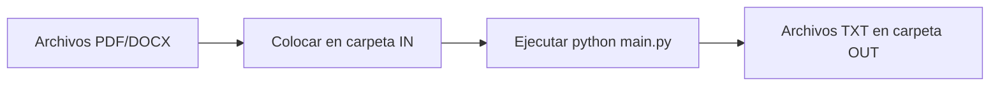

# 📘 Guía Completa de Instalación y Uso para Proyectos RAG

## 🎯 ¿Qué es esta Herramienta?

Esta es una utilidad de **conversión de documentos** (PDF/DOCX a TXT) diseñada para preparar documentos que serán utilizados en sistemas **RAG (Retrieval-Augmented Generation)**.

### 🤖 ¿Qué es RAG?

**RAG (Retrieval-Augmented Generation)** es una técnica que combina:
- **Retrieval (Recuperación)**: Buscar información relevante en documentos
- **Generation (Generación)**: Usar IA (como ChatGPT, Claude, etc.) para generar respuestas basadas en esa información

**Flujo típico de RAG:**
```
Documentos PDF/DOCX → Conversión a TXT → Vectorización → Base de Datos → Consultas con IA
```

Esta herramienta cubre el **primer paso**: convertir tus documentos a texto plano para que puedan ser procesados por sistemas RAG.

---

## 📋 Tabla de Contenidos

1. [Requisitos del Sistema](#-requisitos-del-sistema)
2. [Instalación de Python en Windows 11](#-instalación-de-python-en-windows-11)
3. [Instalación de Git](#-instalación-de-git)
4. [Clonar el Repositorio](#-clonar-el-repositorio)
5. [Instalación de Dependencias](#-instalación-de-dependencias)
6. [Configurar Entorno con Conda (Opcional)](#-configurar-entorno-con-conda-opcional)
7. [Uso Básico de la Herramienta](#-uso-básico-de-la-herramienta)
8. [Integración con Sistemas RAG](#-integración-con-sistemas-rag)
9. [Solución de Problemas](#-solución-de-problemas)
10. [Preguntas Frecuentes](#-preguntas-frecuentes)

---

## 💻 Requisitos del Sistema

### Hardware Mínimo
- **Procesador**: Intel i5 o equivalente (64-bit)
- **RAM**: 4 GB mínimo (8 GB recomendado)
- **Espacio en disco**: 500 MB libres
- **Sistema Operativo**: Windows 11 (64-bit)

### Software Requerido
- ✅ **Python 3.8+** (3.11 recomendado)
- ✅ **Git** (para clonar el repositorio)
- ✅ **PowerShell** (incluido en Windows 11)

### Software Opcional (Recomendado)
- 🎯 **Miniconda/Anaconda** (gestión de entornos virtuales)
- 🎯 **VS Code** (editor de código)

---

## 🐍 Instalación de Python en Windows 11

### Paso 1: Descargar Python

1. Abre tu navegador y ve a: **https://www.python.org/downloads/**
2. Haz clic en el botón amarillo **"Download Python 3.x.x"** (la versión más reciente)

**O descarga directamente:**
```
https://www.python.org/ftp/python/3.11.9/python-3.11.9-amd64.exe
```

### Paso 2: Instalar Python

1. **Ejecuta el archivo descargado** (`.exe`)
2. ⚠️ **IMPORTANTE**: Antes de hacer clic en "Install Now", marca estas casillas:

   ```
   ☑️ Add python.exe to PATH
   ☑️ Use admin privileges when installing py.exe
   ```

   

3. Haz clic en **"Install Now"**
4. Espera a que termine la instalación
5. Haz clic en **"Close"**

### Paso 3: Verificar la Instalación

1. Presiona `Win + R`
2. Escribe `powershell` y presiona `Enter`
3. En la ventana de PowerShell, escribe:

```powershell
python --version
```

Deberías ver algo como:
```
Python 3.11.9
```

4. También verifica pip (gestor de paquetes):

```powershell
pip --version
```

Deberías ver:
```
pip 24.x from ... (python 3.11)
```

### ⚠️ Si Python no se Reconoce

Si recibes un error como `'python' is not recognized`, haz esto:

1. Cierra todas las ventanas de PowerShell
2. Abre una **nueva** ventana de PowerShell
3. Si aún no funciona, reinstala Python asegurándote de marcar **"Add to PATH"**

---

## 🛠️ Instalación de Git

### ¿Qué es Git?

**Git** es un sistema de control de versiones que te permite descargar y actualizar código desde repositorios como GitHub.

### Paso 1: Descargar Git

1. Ve a: **https://git-scm.com/download/win**
2. La descarga debería iniciar automáticamente
3. Si no, haz clic en **"Click here to download manually"**

### Paso 2: Instalar Git

1. **Ejecuta el archivo descargado** (`.exe`)
2. Sigue el asistente con estas configuraciones:

| Pantalla | Selección Recomendada |
|----------|----------------------|
| License Agreement | Next |
| Select Destination Location | Next (default) |
| Select Components | ✅ Git Bash Here ✅ Git LFS |
| Start Menu Folder | Next |
| Default Editor | VS Code o Notepad |
| Let Git decide | Next |
| Git from the command line | ✅ Git from the command line and also from 3rd-party software |
| HTTPS backend | ✅ Use the OpenSSL library |
| Line endings | ✅ Checkout Windows-style, commit Unix-style |
| Terminal emulator | ✅ Use MinTTY |
| git pull | ✅ Default (fast-forward) |
| Credential Manager | ✅ Git Credential Manager |
| Extra options | ✅ Enable file system caching |

3. Haz clic en **"Install"**
4. Espera a que termine
5. Haz clic en **"Finish"**

### Paso 3: Verificar la Instalación

Abre una **nueva** ventana de PowerShell y ejecuta:

```powershell
git --version
```

Deberías ver:
```
git version 2.44.0.windows.1
```

### Paso 4: Configurar Git (Primera vez)

Configura tu identidad (necesario para hacer commits):

```powershell
git config --global user.name "Tu Nombre"
git config --global user.email "tu-email@ejemplo.com"
```

Verificar la configuración:

```powershell
git config --list
```

---

## 📦 Clonar el Repositorio

### ¿Qué es "Clonar"?

**Clonar** significa descargar una copia completa del proyecto a tu computadora, incluyendo todo el historial de cambios.

### Paso 1: Abrir PowerShell

1. Presiona `Win + X`
2. Selecciona **"Terminal"** o **"Windows PowerShell"**
3. Navega a donde quieres guardar el proyecto, por ejemplo:

```powershell
cd F:\Proyectos
```

Si la carpeta no existe, créala:

```powershell
mkdir F:\Proyectos
cd F:\Proyectos
```

### Paso 2: Clonar el Repositorio

```powershell
git clone https://github.com/tu-usuario/pdf2txt.git
```

**Nota**: Reemplaza `https://github.com/tu-usuario/pdf2txt.git` con la URL real del repositorio.

### Paso 3: Entrar al Directorio

```powershell
cd pdf2txt
```

### Verificar la Estructura

Para ver los archivos descargados:

```powershell
dir
```

Deberías ver:
```
Directorio: F:\Proyectos\pdf2txt

Mode    LastWriteTime     Length Name
----    -------------     ------ ----
d-----  14/04/2026        IN
d-----  14/04/2026        OUT
-a----  14/04/2026        main.py
-a----  14/04/2026        README.md
-a----  14/04/2026        .gitignore
```

---

## 🔧 Instalación de Dependencias

Las **dependencias** son bibliotecas externas que el proyecto necesita para funcionar.

### Opción A: Usando pip (Recomendado para Principiantes)

#### Paso 1: Abrir PowerShell en la Carpeta del Proyecto

```powershell
cd F:\Proyectos\pdf2txt
```

#### Paso 2: Instalar las Dependencias

```powershell
pip install pdfplumber python-docx
```

Verás algo como:
```
Collecting pdfplumber
  Downloading pdfplumber-0.11.0-py3-none-any.whl (57 kB)
Collecting python-docx
  Downloading python_docx-1.1.0-py3-none-any.whl (239 kB)
Installing collected packages: ...
Successfully installed pdfplumber-0.11.0 python-docx-1.1.0
```

#### Paso 3: Verificar la Instalación

```powershell
python -c "import pdfplumber; print('✅ pdfplumber instalado correctamente')"
python -c "from docx import Document; print('✅ python-docx instalado correctamente')"
```

### Opción B: Usando conda (Ver Sección Siguiente)

Si prefieres usar conda, salta a la sección **[Configurar Entorno con Conda](#-configurar-entorno-con-conda-opcional)**.

---

## 🎯 Configurar Entorno con Conda (Opcional)

### ¿Qué es Conda y Por Qué Usarlo?

**Conda** es un gestor de entornos virtuales que:
- ✅ Aísla las dependencias de cada proyecto
- ✅ Evita conflictos entre versiones
- ✅ Permite tener múltiples versiones de Python
- ✅ Facilita la reproducibilidad

**Analogía**: Piensa en conda como "cajas separadas" para cada proyecto. Lo que instalas en una caja no afecta a las demás.

### Miniconda vs Anaconda

| Característica | Miniconda | Anaconda |
|----------------|-----------|----------|
| Tamaño | ~100 MB | ~3 GB |
| Paquetes incluidos | Solo Python + conda | +400 paquetes científicos |
| Velocidad de instalación | Rápida | Lenta |
| **Recomendado para** | ✅ **Este proyecto** | Data science completo |

**Conclusión**: Usa **Miniconda** para este proyecto.

### Paso 1: Descargar Miniconda

1. Ve a: **https://docs.conda.io/en/latest/miniconda.html**
2. Descarga **Miniconda3 Windows 64-bit** (archivo `.exe`)

**O descarga directamente:**
```
https://repo.anaconda.com/miniconda/Miniconda3-latest-Windows-x86_64.exe
```

### Paso 2: Instalar Miniconda

1. **Ejecuta el archivo `.exe`**
2. Haz clic en **"Next"**
3. Acepta la licencia → **"I Agree"**
4. Selecciona **"Just Me"** → **"Next"**
5. Elige la carpeta de instalación (por defecto: `C:\Users\TuUsuario\miniconda3`) → **"Next"**
6. ⚠️ **IMPORTANTE**: Marca ambas casillas:

   ```
   ☑️ Add Miniconda3 to my PATH environment variable
   ☑️ Register Miniconda3 as my default Python 3.x
   ```

7. Haz clic en **"Install"**
8. Espera a que termine
9. Haz clic en **"Next"** y luego **"Finish"**

### Paso 3: Verificar la Instalación

Abre una **nueva** ventana de PowerShell (importante que sea nueva):

```powershell
conda --version
```

Deberías ver:
```
conda 24.3.0
```

### Paso 4: Crear un Entorno Virtual para el Proyecto

```powershell
# Navega a la carpeta del proyecto
cd F:\Proyectos\pdf2txt

# Crear un entorno virtual llamado "pdf2txt" con Python 3.11
conda create -n pdf2txt python=3.11 -y
```

Esto tomará unos minutos. Verás:
```
Downloading and Extracting Packages
Preparing transaction: done
Verifying transaction: done
Executing transaction: done
#
# To activate this environment, use
#
#     $ conda activate pdf2txt
```

### Paso 5: Activar el Entorno

```powershell
conda activate pdf2txt
```

Verás que tu prompt cambia:
```
(pdf2txt) PS F:\Proyectos\pdf2txt>
```

El `(pdf2txt)` indica que estás dentro del entorno virtual.

### Paso 6: Instalar Dependencias en el Entorno

```powershell
conda install -c conda-forge pdfplumber python-docx -y
```

### Paso 7: Verificar Todo Funciona

```powershell
python -c "import pdfplumber; print('✅ pdfplumber OK')"
python -c "from docx import Document; print('✅ python-docx OK')"
```

### Comandos Útiles de Conda

| Acción | Comando |
|--------|---------|
| Activar entorno | `conda activate pdf2txt` |
| Desactivar entorno | `conda deactivate` |
| Ver entornos instalados | `conda env list` |
| Ver paquetes instalados | `conda list` |
| Actualizar conda | `conda update conda` |
| Eliminar entorno | `conda env remove -n pdf2txt` |

---

## 🚀 Uso Básico de la Herramienta

### Estructura del Proyecto

```
pdf2txt/
├── main.py              # Script principal (NO MODIFICAR)
├── IN/                  # 📥 Carpeta de ENTRADA (coloca aquí tus archivos)
│   └── (tus PDFs/DOCX)
├── OUT/                 # 📤 Carpeta de SALIDA (aquí aparecerán los TXT)
│   └── (archivos convertidos)
├── README.md            # Documentación técnica
└── Guia.md              # Esta guía
```

### Flujo de Trabajo



### Paso 1: Preparar los Archivos de Entrada

1. **Coloca tus archivos PDF o DOCX** dentro de la carpeta `IN`

   ```
   IN/
   ├── documento1.pdf
   ├── documento2.docx
   └── subcarpeta/
       └── documento3.pdf
   ```

2. **Puedes crear subcarpetas** para organizar tus documentos:

   ```
   IN/
   ├── sentencias/
   │   ├── causa1.pdf
   │   └── causa2.pdf
   ├── contratos/
   │   └── contrato1.docx
   └── informes/
       └── informe2024.pdf
   ```

### Paso 2: Ejecutar la Conversión

#### Desde PowerShell

```powershell
# Asegúrate de estar en la carpeta del proyecto
cd F:\Proyectos\pdf2txt

# Si usas conda, activa el entorno
conda activate pdf2txt

# Ejecutar el script
python main.py
```

#### Con Doble Clic (Windows)

1. Haz **doble clic** en `main.py`
2. Se abrirá una ventana de consola
3. Espera a que termine el proceso
4. Verás `"Presiona Enter para cerrar..."`
5. Presiona `Enter` para cerrar

### Paso 3: Verificar los Resultados

Los archivos TXT aparecerán en la carpeta `OUT` con la **misma estructura** que `IN`:

```
OUT/
├── sentencias/
│   ├── causa1.txt
│   └── causa2.txt
├── contratos/
│   └── contrato1.txt
└── informes/
    └── informe2024.txt
```

### Ejemplo de Salida

Cada archivo TXT comenzará con la **categoría** basada en su ubicación:

```
categoría: sentencias

[Contenido extraído del PDF o DOCX...]
```

Esto es **ideal para sistemas RAG**, ya que la categoría ayuda a contextualizar el documento.

### Paso 4: Usar los Archivos TXT en tu Sistema RAG

Ahora que tienes tus documentos en formato TXT, puedes:

1. **Cargarlos en una base de datos vectorial** (Pinecone, ChromaDB, Milvus, etc.)
2. **Crear embeddings** con OpenAI, HuggingFace, etc.
3. **Configurar tu pipeline RAG** para consultas

Ver la sección **[Integración con Sistemas RAG](#-integración-con-sistemas-rag)** para más detalles.

---

## 🔗 Integración con Sistemas RAG

### ¿Qué Hacer Después de Convertir los Documentos?

Una vez que tienes tus archivos TXT, el siguiente paso es integrarlos en un **pipeline RAG**. Aquí te mostramos las opciones más populares:

### Opción 1: LangChain + ChromaDB (Recomendado para Principiantes)

#### ¿Qué es LangChain?

**LangChain** es un framework que facilita la creación de aplicaciones con LLMs (Modelos de Lenguaje Grande).

#### ¿Qué es ChromaDB?

**ChromaDB** es una base de datos vectorial open-source para almacenar y buscar embeddings.

#### Instalación

```powershell
pip install langchain langchain-openai chromadb
```

#### Ejemplo Básico de Código

```python
from langchain_community.document_loaders import DirectoryLoader
from langchain.text_splitter import CharacterTextSplitter
from langchain_openai import OpenAIEmbeddings
from langchain_chroma import Chroma

# 1. Cargar documentos desde la carpeta OUT
loader = DirectoryLoader("OUT/", glob="**/*.txt")
documents = loader.load()

# 2. Dividir documentos en chunks
text_splitter = CharacterTextSplitter(chunk_size=1000, chunk_overlap=200)
chunks = text_splitter.split_documents(documents)

# 3. Crear embeddings y almacenar en ChromaDB
embeddings = OpenAIEmbeddings()
db = Chroma.from_documents(chunks, embeddings, persist_directory="./chroma_db")

# 4. Hacer consultas
query = "¿Qué dice el documento sobre daños?"
results = db.similarity_search(query)

for doc in results:
    print(doc.page_content)
    print(f"Categoría: {doc.metadata.get('source')}")
```

### Opción 2: LlamaIndex

#### ¿Qué es LlamaIndex?

**LlamaIndex** es una herramienta especializada para estructurar datos privados para LLMs.

#### Instalación

```powershell
pip install llama-index
```

#### Ejemplo Básico

```python
from llama_index.core import VectorStoreIndex, SimpleDirectoryReader

# Cargar documentos
documents = SimpleDirectoryReader("OUT/").load_data()

# Crear índice
index = VectorStoreIndex.from_documents(documents)

# Crear motor de consulta
query_engine = index.as_query_engine()

# Consultar
response = query_engine.query("¿Cuál es la conclusión principal?")
print(response)
```

### Opción 3: Haystack

#### ¿Qué es Haystack?

**Haystack** es un framework end-to-end para construir sistemas de búsqueda y RAG.

#### Instalación

```powershell
pip install farm-haystack
```

### Comparación de Herramientas

| Herramienta | Facilidad de Uso | Flexibilidad | Comunidad | Recomendado para |
|-------------|------------------|--------------|-----------|------------------|
| **LangChain** | ⭐⭐⭐ | ⭐⭐⭐⭐⭐ | Grande | Proyectos personalizados |
| **LlamaIndex** | ⭐⭐⭐⭐ | ⭐⭐⭐⭐ | Creciente | Indexación de documentos |
| **Haystack** | ⭐⭐ | ⭐⭐⭐⭐⭐ | Moderada | Producción empresarial |

### Flujo Completo RAG

```
┌─────────────────┐
│  Documentos     │
│  PDF/DOCX       │
└────────┬────────┘
         │
         ▼
┌─────────────────┐
│  pdf2txt        │ ← ¡Esta herramienta!
│  (PDF→TXT)      │
└────────┬────────┘
         │
         ▼
┌─────────────────┐
│  Text Splitter  │
│  (Chunks)       │
└────────┬────────┘
         │
         ▼
┌─────────────────┐
│  Embeddings     │
│  (OpenAI, etc.) │
└────────┬────────┘
         │
         ▼
┌─────────────────┐
│  Vector DB      │
│  (Chroma, etc.) │
└────────┬────────┘
         │
         ▼
┌─────────────────┐
│  LLM + Query    │
│  (ChatGPT, etc.)│
└─────────────────┘
```

---

## 🛠️ Solución de Problemas

### Error: `'python' is not recognized`

**Causa**: Python no está en el PATH o no está instalado.

**Solución**:
1. Verifica que Python esté instalado:
   ```powershell
   where python
   ```
2. Si no aparece, reinstala Python marcando **"Add to PATH"**
3. Reinicia PowerShell

### Error: `pip no se reconoce`

**Causa**: pip no está instalado o no está en el PATH.

**Solución**:
```powershell
python -m pip install pdfplumber python-docx
```

### Error: `ModuleNotFoundError: No module named 'pdfplumber'`

**Causa**: Las dependencias no están instaladas.

**Solución**:
```powershell
pip install pdfplumber python-docx
```

Si usas conda:
```powershell
conda activate pdf2txt
conda install -c conda-forge pdfplumber python-docx -y
```

### Error: `PermissionError` al instalar

**Causa**: No tienes permisos de administrador.

**Solución**:
```powershell
pip install --user pdfplumber python-docx
```

### Error: PDF no se procesa correctamente

**Causa**: El PDF puede ser una imagen escaneada.

**Solución**:
- Si el PDF es una imagen, necesitas **OCR** (Reconocimiento Óptico de Caracteres)
- Instala `pdfplumber` con soporte OCR:
  ```powershell
  pip install pdfplumber[ocr]
  ```

### Error: La ventana se cierra inmediatamente

**Causa**: El script termina rápidamente o hay un error.

**Solución**:
1. Abre PowerShell manualmente
2. Navega a la carpeta del proyecto
3. Ejecuta:
   ```powershell
   python main.py
   ```
4. Lee el mensaje de error

### Error: `conda: The term 'conda' is not recognized`

**Causa**: Miniconda/Anaconda no está en el PATH.

**Solución**:
1. Busca **"Anaconda Prompt"** o **"Miniconda Prompt"** en el menú Inicio
2. Abre ese prompt (ya tiene conda configurado)
3. Navega a la carpeta del proyecto:
   ```powershell
   cd F:\Proyectos\pdf2txt
   ```

### Error: No se pueden ejecutar scripts en PowerShell

**Causa**: Política de ejecución de PowerShell restringe scripts.

**Solución** (ejecutar como Administrador):
```powershell
Set-ExecutionPolicy -ExecutionPolicy RemoteSigned -Scope CurrentUser
```

### Los archivos TXT están vacíos

**Causa**: Los PDFs pueden ser imágenes escaneadas sin texto extraíble.

**Solución**:
1. Verifica si el PDF tiene texto seleccionable:
   - Abre el PDF
   - Intenta seleccionar texto con el mouse
   - Si no puedes, es una imagen
2. Para PDFs escaneados, necesitas una herramienta de **OCR** como:
   - **Tesseract OCR**: `pip install pytesseract`
   - **Adobe Acrobat** (comercial)
   - **Online OCR tools**

### La conversión es muy lenta

**Causa**: Archivos muy grandes o muchos documentos.

**Soluciones**:
1. Procesa lotes más pequeños
2. Usa una máquina con más RAM
3. Considera usar procesamiento en paralelo (requiere modificar el código)

---

## ❓ Preguntas Frecuentes

### ¿Puedo usar archivos de otras carpetas?

**Sí**, puedes pasar una ruta específica como argumento:

```powershell
python main.py "C:\ruta\a\mi\archivo.pdf"
```

### ¿La herramienta modifica los archivos originales?

**No**, solo lee los archivos de entrada y crea nuevos archivos TXT en la carpeta `OUT`.

### ¿Puedo usar la herramienta con otros tipos de archivos?

Actualmente solo soporta **PDF** y **DOCX**. Para otros formatos necesitas herramientas diferentes.

### ¿Qué hago si un PDF tiene imágenes?

Los PDFs que son imágenes escaneadas **no pueden ser procesados** directamente. Necesitas:

1. **OCR (Reconocimiento Óptico de Caracteres)**:
   ```powershell
   pip install pytesseract pillow
   ```

2. Usar una herramienta de OCR antes de la conversión

### ¿Puedo ejecutar la herramienta desde cualquier ubicación?

**Sí**, pero debes estar en la carpeta del proyecto o especificar la ruta completa:

```powershell
python F:\Proyectos\pdf2txt\main.py
```

### ¿Los archivos TXT mantienen el formato original?

**No completamente**. La conversión a texto plano pierde:
- ❌ Negritas, cursivas
- ❌ Colores
- ❌ Imágenes
- ❌ Tablas complejas

Pero **mantiene**:
- ✅ El texto completo
- ✅ Saltos de línea
- ✅ Estructura básica

### ¿Para qué sirve la "categoría" en los archivos TXT?

La categoría se genera automáticamente basada en la **estructura de carpetas** donde estaba el archivo. Esto es útil para:

- 📂 **Organización**: Saber de dónde viene cada documento
- 🔍 **RAG**: Contextualizar las consultas
- 📊 **Filtrado**: Buscar solo en ciertas categorías

### ¿Puedo usar esto para un proyecto comercial?

**Sí**, el proyecto tiene licencia **MIT**, que permite uso comercial.

### ¿Cómo actualizo la herramienta?

Si el repositorio se actualiza:

```powershell
cd F:\Proyectos\pdf2txt
git pull
```

### ¿Dónde puedo obtener ayuda adicional?

- 📧 **Issues en GitHub**: Abre un issue en el repositorio
- 💬 **Documentación**: Lee el `README.md`
- 🤝 **Comunidad**: Busca foros o Discord relacionados

---

## 📚 Recursos Adicionales

### Documentación Oficial

- **Python**: https://docs.python.org/3/
- **Git**: https://git-scm.com/doc
- **Miniconda**: https://docs.conda.io/en/latest/miniconda.html

### Herramientas RAG

- **LangChain**: https://python.langchain.com/
- **LlamaIndex**: https://docs.llamaindex.ai/
- **ChromaDB**: https://www.trychroma.com/
- **Haystack**: https://haystack.deepset.ai/

### Servicios de Embeddings

- **OpenAI**: https://platform.openai.com/docs/guides/embeddings
- **HuggingFace**: https://huggingface.co/models?pipeline_tag=sentence-similarity
- **Cohere**: https://docs.cohere.com/docs/embed

### Bases de Datos Vectoriales

- **ChromaDB**: https://www.trychroma.com/
- **Pinecone**: https://www.pinecone.io/
- **Milvus**: https://milvus.io/
- **Weaviate**: https://weaviate.io/

### Tutoriales Recomendados

1. **RAG con LangChain**: https://python.langchain.com/docs/use_cases/question_answering/
2. **LlamaIndex Tutorial**: https://docs.llamaindex.ai/en/stable/getting_started/starter_example.html
3. **ChromaDB Tutorial**: https://docs.trychroma.com/docs/getting-started/quickstart

---

## 🎓 Glosario de Términos

| Término | Definición |
|---------|------------|
| **RAG** | Retrieval-Augmented Generation: Técnica que combina búsqueda de documentos con generación de IA |
| **Embedding** | Representación numérica de texto que captura su significado semántico |
| **Vector DB** | Base de datos que almacena y busca vectores (embeddings) |
| **Chunk** | Fragmento de texto dividido para procesamiento |
| **OCR** | Optical Character Recognition: Tecnología para extraer texto de imágenes |
| **PATH** | Variable de sistema que indica dónde buscar ejecutables |
| **Entorno Virtual** | Espacio aislado para instalar dependencias de un proyecto |
| **Git Clone** | Descargar una copia completa de un repositorio |
| **pip** | Gestor de paquetes de Python |
| **conda** | Gestor de entornos y paquetes (alternativa a pip) |

---

## ✅ Checklist de Verificación Final

Antes de empezar, verifica que todo está listo:

- [ ] Python instalado y funcionando (`python --version`)
- [ ] Git instalado (`git --version`)
- [ ] Repositorio clonado
- [ ] Dependencias instaladas (`pip list` muestra pdfplumber y python-docx)
- [ ] Carpeta `IN` existe y tiene archivos PDF/DOCX
- [ ] Carpeta `OUT` existe (se crea automáticamente)
- [ ] Ejecución de prueba exitosa (`python main.py`)

Si marcaste todas las casillas, **¡estás listo para usar la herramienta!** 🎉

---

## 📞 Soporte

Si encuentras problemas que no están en la sección de solución de problemas:

1. **Revisa el README.md** del proyecto
2. **Abre un Issue** en GitHub con:
   - Descripción del problema
   - Pasos para reproducirlo
   - Capturas de pantalla
   - Tu sistema operativo y versión de Python

---

**Última actualización**: 14 de abril de 2026

**Versión de la guía**: 1.0

---

## 📝 Notas Finales

Esta guía está diseñada para ser **completa y autónoma**. Un usuario nuevo de Windows 11 debería poder seguir estos pasos sin conocimiento previo de programación.

Si algo no está claro o falta información, por favor abre un issue en el repositorio.

**¡Buena suerte con tu proyecto RAG!** 🚀
